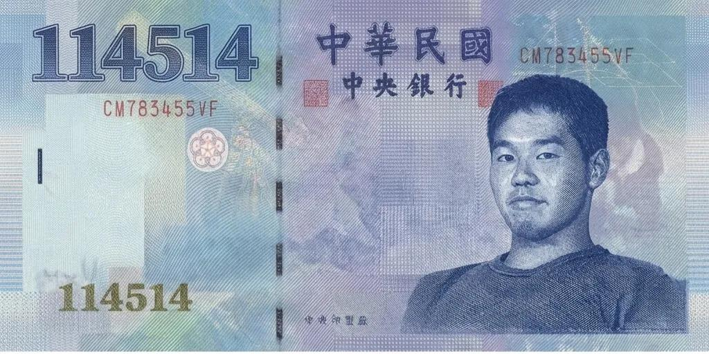

+++
date = '2026-08-12T23:38:56+08:00'
draft = false
title = '開始寫文章吧'
+++

早安安我是希爾ww我也來嘗試寫文章了,我這個週記都不太想寫的人居然會想要來玩ww

## 為什麼會想接觸部落格？

### 心理想法
還記的8/8在 SITCON BoF透過比例認識了[JN](https://blog.giveanornot.com/)

比例跟我說他很喜歡部落格,因為部落格的文章品質比較高,也會比脆上的傻逼還要少(傻逼是我自己加的 聽比例這麼說...我確實也有這樣的感覺,我也希望日後我可以拿手機看部落格的時間比看社群網站的時間多

### 執念ww
有一個應該是我今年有的想法。

我很討厭大廠的壟斷,我的感覺是只要用她門的東西,就絕對會被她們所控制,
比如前幾個月meta使用AI判定導致很多人的帳號因此被封鎖,但帳號被鎖的人只是正常的活著和呼吸而已www

以我自己的經歷,我是更改IG的連結而被要求輸入電話號碼驗證,有一次成功一次失敗,然後因為我要求發送很多簡訊導致我只能24小時後再試,這段期間我沒辦法透過ig聯絡人或是看貼文,當時被鎖的我萌生想要demeta的想法w

## 可是我會想把這裡當另一個說話的空間w
我雖然真的真的很討厭IG或是Threads那樣的壟斷w但我仍然會使用這兩個軟體和看blog,這裡只是我可以想說什麼就說什麼的空間,或是想偷看朋友最近在做什麼的ww,除非某天朋友們都來玩blog或是我沒有活網的需求的時候就會漸漸切換到blog了www

這是我的第一篇文章,謝謝你看到這裡><