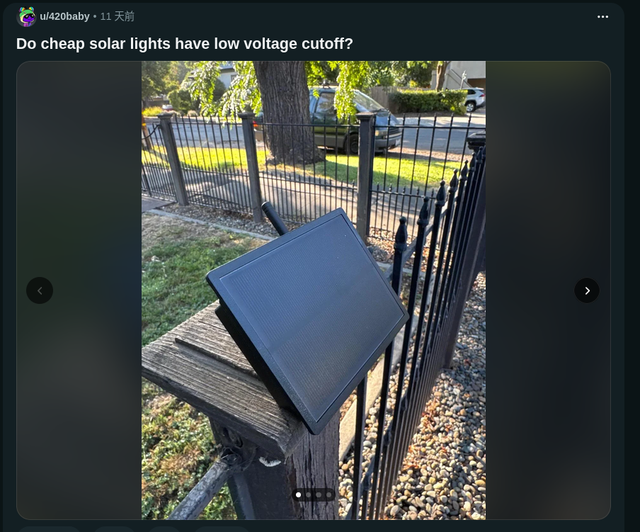

+++
date = '2026-08-12T23:38:56+08:00'
draft = true
title = 'meshtastic是什麼?'
tags = ["專案Project"]
+++

經過了前幾天的萬安演習,在行動網路斷線時我們該如何應對？ 我們或許沒辦法在斷網時聯絡其他人,但我們可以提前預防斷網或網路受限時我們可以透過meshtastic

meshtastic是一個開源的專案(以下稱esp32或是任何支持LoRa訊號的開發板叫板子

先介紹專有名詞背後的意思

1.LoRa:一種低功耗的無線通訊技術,通常用於空拍機或是meshtastic或是智慧城市或智慧農業,但頻寬小,傳輸速率低,不適合拿來傳輸大量資料或是影像

2.板子或是開發版:板子是meshtastic傳輸資料的載體,因為手機沒有辦法直接傳輸LoRa訊號,所以需要透過開發版去使用USB或是藍芽連接手機,而板子有很多類型,有esp32的還有其他的（我就是買Esp32-S3來玩 但購買的時候要注意,台灣可以用的頻率是915Mhz,千萬別像主包一樣買到413或其他的。這樣可能會有法規風險

.jpg)

3.節點:節點這個概念可以理解是轉發者,跟路上看到的基地台很像

歐給繼續回到meshtastic是一個開源的專案w他是由使用者自行建立節點且不依賴伺服器與基礎建設的東西,同時這個東西她的功耗很低,大多的移動使用者會搭配使用18650電池,依據鎖使用的晶片類型,續航可達3天到5天（甚至更久 固定在家或其他地方的使用者會使用太陽能版+18650電池讓它運作

[**圖片來自Reddit**](https://www.reddit.com/r/meshtastic/s/z5fvVO7wNX)

